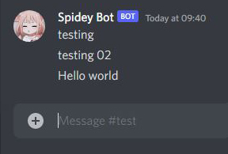

<h1 align="center"> Discord Channel Mirror Bot </h1>

<h2 align="center">

</h2>

<h3 align="center">  </h3>
    
<h4 align="center"> 

 </h4>

<h4 align="center"> You can mirror any Discord Server's channel to Your Server Channel without admin Permission. </h4>

**You only need :**
1. Your Typing authorization code  
2. Your Mirror channel ID. ( Not your webhook Channel ID )
3. webhook link.

Run the script using "`node app.js`"

  

## ⚠️ Important ⚠️
This bot repeat your any text messages including links & Emojis. **But bot can't repeat anything upload** Like Images, Videos, Document.
#
### 👨‍💻 Programming languages

#
### 🗄️ Databases

#
### 💻 Software and tools

#
## Streak stats
<!-- GitHub Readme Streak Stats - https://github.com/DenverCoder1/github-readme-streak-stats -->

  

