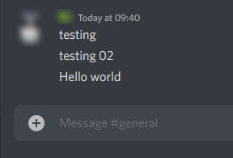

# Discord-Channel-Mirror
You can mirror any discord server channel to another server channe without admin Permission.

**You only need :**
1. Your Typing authorization code  
2. Your Mirror channel ID. ( Not your webhook Channel ID )
3. webhook link.

Run the script using "`node app.js`"

